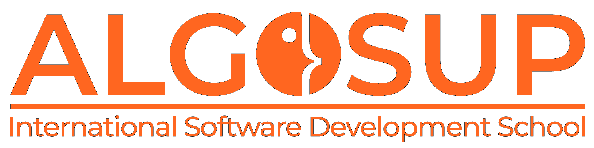

# The Project

This project is a student project provided by ALGOSUP, based in Vierzon.( → see the [**call for tender**](/documents/.data/Call_for_tender_-_2023-2024_Project_3_Virtual_Processor.pdf))
The objective is to build a virtual processor and its components in C and to create our own assembly language to interact with it.

# The Members

| Name            | Role              | Image                                                        | Link                                                         |
| ---------------- | ----------------- | ------------------------------------------------------------ | ------------------------------------------------------------ |
| Benoît DE KEYN | Project Manager   |  | [Benoît\'s Github Profile](https://github.com/benoitdekeyn-algosup) |
| Léo CHARTIER    | Program Manager   |  | [Léo\'s Github Profile](https://github.com/leo-chartier) |
| Jason GROSSO    | Tech Lead         |  | [Jason\'s Github Profile](https://github.com/jasonGROSSO) |
| Antoine PREVOST | Software Engineer |  | [Antoine\'s Github Profile](https://github.com/TechXplorerFR) |
| Max BERNARD     | Software Engineer |  | [Max\'s Github Profile](https://github.com/maxbernard3) |
| Maxime THIZEAU  | Quality Assurance |  | [Maxime\'s Github Profile](https://github.com/MaximeTAlgosup) |

# The Manual

## Download

Just download the code of the project [from the last release](https://github.com/algosup/2023-2024-project-3-virtual-processor-team-4/releases) or directly [the zip of the main code](https://github.com/algosup/2023-2024-project-3-virtual-processor-team-4/archive/refs/heads/main.zip).
Then, unzip it, and follow the instructions below ↓

## Use

You first need to install 'gcc' (a C compiler) on your machine

### For Windows

(empty for now)

### For MacOS

(empty for now)

### For Linux

(empty for now)

# Related documents

- [Functional specifications](https://github.com/algosup/2023-2024-project-3-virtual-processor-team-4/blob/main/documents/functional/functionalSpecification.md)
- [Technical specifications](https://github.com/algosup/2023-2024-project-3-virtual-processor-team-4/blob/main/documents/technical/technicalSpecification.md)
- [Test Plan](https://github.com/algosup/2023-2024-project-3-virtual-processor-team-4/blob/main/documents/QA/testPlan.md)
- [KPIs](https://algosup-my.sharepoint.com/:x:/r/personal/benoit_dekeyn_algosup_com/_layouts/15/doc2.aspx?sourcedoc=%7BA6E7D73D-0366-4F0D-A4B7-932DC4AE6EF2%7D&file=Livre.xlsx&action=editnew&mobileredirect=true&wdNewAndOpenCt=1705502980352&ct=1705502980709&wdOrigin=OFFICECOM-WEB.MAIN.NEW&wdPreviousSessionSrc=HarmonyWeb&wdPreviousSession=67a6512f-83b6-47d1-a15c-38e269217ee2&cid=0ee4bf9b-ef3d-4f55-9a31-d0b5b0c875d8)
- [Tasks Board](https://trello.com/b/fyHkoXl9/virtual-processor-team-4)
- [Weekly report]("documents\management\Weekly Report\Cumulative.md")

# Dates

- We started the project on Wednesday, January 17th of 2024

- The deadline of the project is on Friday, January 23th

- Date of the last official update of the project : 17/01/2024

# License

This project is under the [Mit License](LICENSE).

