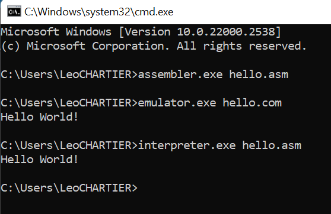

# Virtual processor - Functional specifications

This project was requested by [ALGOSUP](https://algosup.com), a French computer science school.

The goal of the project is to create a virtual processor and an interpreter for running assembly code on 
that processor.
The assembly language will also be created and tailored by us.

<details>
<summary>Table of Contents</summary>

- [Stakeholders](#stakeholders)
  - [Project members](#project-members)
  - [Other stakeholders](#other-stakeholders)
- [Project scope](#project-scope)
- [Functional requirements](#functional-requirements)
- [Deliverables and milestones](#deliverables-and-milestones)
    - [Final product](#final-product)
- [Personas and use cases](#personas-and-use-cases)
  - [Persona 1 - Oceane Thomas](#persona-1---oceane-thomas)
    - [Goals](#goals)
    - [Challenges](#challenges)
  - [Persona 2 - John Mayers](#persona-2---john-mayers)
    - [Goals](#goals-1)
    - [Challenges](#challenges-1)
  - [Persona 3 - Patricia Farmer](#persona-3---patricia-farmer)
    - [Goals](#goals-2)
    - [Challenges](#challenges-2)
- [Acceptance criteria](#acceptance-criteria)
- [Solution overview](#solution-overview)
  - [System architecture](#system-architecture)
  - [Assembly syntax](#assembly-syntax)
  - [Assembly instructions](#assembly-instructions)
  - [Machine code](#machine-code)
  - [Errors](#errors)
  - [Usage](#usage)
- [Non-functional requirements](#non-functional-requirements)
  - [Performance](#performance)
  - [Maintainability](#maintainability)
  - [Scalability](#scalability)
  - [Portability](#portability)
  - [Usability](#usability)
  - [Security](#security)
- [Example](#example)
- [Risks and assumptions](#risks-and-assumptions)
- [Future improvements](#future-improvements)
- [Glossary](#glossary)
</summary></details>

## Stakeholders

### Project members

| Full name       | Occupation               | Links                                                             |
| --------------- | ------------------------ | ----------------------------------------------------------------- |
| Benoît DE KEYN  | Project manager          | [LinkedIn](https://linkedin.com/in/beno%C3%AEt-de-keyn-71611b293) |
| Léo CHARTIER    | Program manager          | [LinkedIn](https://linkedin.com/in/l%C3%A9o-chartier-367111221)   |
| Jason GROSSO    | Tech lead                | [LinkedIn](https://linkedin.com/in/jason-grosso-847b39251)        |
| Max BERNARD     | Senior software engineer | [LinkedIn](https://linkedin.com/in/max-bernard-b77680210)         |
| Antoine PREVOST | Junior software engineer | [LinkedIn](https://linkedin.com/in/antoine-prevost-dev)           |
| Maxime THIZEAU  | Quality assurance        | [LinkedIn](https://linkedin.com/in/maxime-thizeau-0b311a293)      |

### Other stakeholders

| Name           | Occupation                  | Links                          |
| -------------- | --------------------------- | ------------------------------ |
| Franck JEANNIN | Client (ALGOSUP's director) | [Website](https://algosup.com) |

## Project scope

We have multiple objectives for this project:
- Creation of an assembly language and [Instruction Set Architecture](#glossary) (ISA) (defined further down in this document and in the [Appendix](./appendix_a_instruction_set_manual.pdf)).
- Implementation of this ISA in the form of a [virtual processor](#glossary) that can be emulated on a physical computer.
- Implementation of an [assembler](#glossary) to create machine code for this processor from the assembly language.
- Provision of sample assembly scripts that can be assembled and run.

## Functional requirements

The instructions of the language must allow for the following actions:
- Data handling i.e. writing data between a register and
  - an immediate value (a constant),
  - another register,
  - the memory (RAM),
  - or the virtual keyboard/display
- Calculations
  - The four basic mathematical operations (addition, subtraction, multiplication, division).
  - The four basic logical operations (not, and, or, xor).
- Branching
  - Comparison between registers and values.
  - Conditional and unconditional jumping.
  - Calling and returning from subroutines.

Both the assembler and emulator must written in the C language, as well as being able to be compiled and run on any real computer architecture.
No libraries outside of the standard ones should be used, and the libraries that are operating system-specific must have existing alternatives.

The assembler must also detect syntactical errors such as invalid lines or invalid parameters. When those happen, it must stop the assembly and alert the user.

Since we are emulating the execution of the machine code, the instructions must be run with a duration similar to what it would be on real hardware.
This means that if an instruction takes 4 clock cycles and another one takes 7, if the first runs in 1.3ms and the second one 3.7ms, we would have to slow the first instruction to have a time factor closer to the real thing. We allow a 10% margin between the time-to-clock cycles of the fastest and slowest instructions (in terms of clock cycles).

The instructions provided and the ISA as a whole must also take into account the evolution of the technology since the beginning of the programming era as well as solve modern world problems encountered with old assembly languages.

## Deliverables and milestones

| Date and time          | Deliverable              |
| ---------------------- | ------------------------ |
| 30 January 2023, 5 PM  | Functional specification |
| 9 February 2023, 5 PM  | Technical specification  |
| 16 February 2023, 5 PM | Test plan                |
| 23 February 2023, 5 PM | Final product            |

#### Final product

The Final product consists of:
- An assembler that translates our assembly to machine code
- An emulator that acts as a virtual CPU to run our machine code

## Personas and use cases

### Persona 1 - Oceane Thomas

Oceane Thomas is an 18-year-old student working to become a CPU Architect. She already knows x64 assembly and C.

#### Goals
  - Oceane wants to learn a new assembly language to gain insight into the various steps and implementations of assembly.
  - She hopes to better understand CPU architecture choices by exploring how a virtual CPU works.

#### Challenges
  - Oceane is looking for an open-source project that allows her to examine its inner workings.
  - She seeks a virtual processor that enables her to observe processes in greater detail than on physical hardware.
  - She needs an easy-to-learn assembly language, as she does not want to spend too much time on the assembly itself.

### Persona 2 - John Mayers

John is a 34-year-old Computer Architect Researcher at IBM. He has been in this role for a few years and believes that drawing inspiration from external projects will enhance his creativity.

#### Goals
  - He aims to discover innovative ideas for CPU architecture.
  - He is looking for solutions that are practical for general use.

#### Challenges
  - He needs a fresh perspective on assembly, as he is specifically seeking new viewpoints.
  - The instructions must be realistically implementable in hardware.
  - He needs to test and prototype quickly without necessarily having the physical CPU on hand.

### Persona 3 - Patricia Farmer

Patricia Farmer is a 31-year-old CTO at a bank. She recently assumed the position and realized that the bank's internal communication system urgently needs an upgrade.

#### Goals
  - She aims to revamp the bank's internal communication system to make it faster.
  - She also intends to enhance its security.

#### Challenges
  - The language and system architecture must be different from the old one to render existing malware obsolete.
  - She cannot replace all the hardware at once. A virtual CPU is temporarily needed to run the new programs on the old hardware.

## Acceptance criteria

The sample scripts -- which cover every instruction -- should be assembled and executed without any problem and their result should meet the expected output.

Both programs should be fail-safe with no segmentation fault, memory corruption, or other issue. In the event that those still happen, the program should catch them and alert the user of the error.

To ensure that the project is viable, all the specifications must be approved by the client and the programs must also be tested by other teams of the school (and potentially external people) to collect their feedback and improve the software.

## Solution overview

### System architecture

The architecture will use 32-bit integers to run. Unless otherwise specified, those integers are supposed signed.

We will consider to have 28 registers. The first 26 are denoted by the letter `r` followed by another letter (`ra`, `rb`, ..., `ry`, `rz`) and their machine code representation is the index of the letter (`ra` = 0, `rb` = 1, ...). \
The other registers are:
- `sp`, the address of the stack pointer. Read-only. Machine code value: 30.
- `ip`, number of the currently executed instruction. Read-only. Machine code value: 31.

The architecture is flagless. This means that when a comparison is done, the result is stored back in a register rather than a flag. For overflows and carry, those must be checked manually.

The stack starts at the address `0xFFFFFFFC` and grows downwards.

The memory mapping we will be using resembles the usual ones and is as follows:

| Address range       | Data            |
| ------------------- | --------------- |
| E0000000 - FFFFFFFF | Reserved system |
| A0000000 - DFFFFFFF | Reserved        |
| 80000000 - 9FFFFFFF | Peripheral      |
| 20000000 - 7FFFFFFF | [S]RAM          |
| 00000000 - 1FFFFFFF | User code       |

### Assembly syntax

The syntax of the assembly language is case-insensitive. It is recommended to keep the same case throughout the whole program but the user may choose to use either uppercase or lowercase at your preference.

The syntax for the instructions follows this pattern: 
`mnem param1 param2 param3`

where `mnem` is the mnemonic for the instruction and the rest are parameters when necessary. For alignment reasons, we allow more than one space before the parameters.

The parameters can either be a register, an immediate value or a label depending on the instruction.

A label declaration should be on a line with no instruction, written in camel case, and followed by a colon: `camelCase:`. A label may only be defined once in a file but jumped to or called any amount of time.

A line only composed with whitespace is to be ignored.

Comments can be added at the end of any line with an instruction or label, starting with a double slash `//`. Any whitespace before the symbol and any text after it until the end of the line is to be ignored.

Immediate values can be written either in decimal or in hexadecimal prefixed with an `x`.

### Assembly instructions

The assembly language consists of the different instructions defined further down.
Here is a summary of those instructions:
- Arithmetic and logic: `add`, `sub`, `mul`, `div`, `or`, `and`, `xor`
- Comparison: `teq`, `tne`, `tlt`, `tle`, `tgt`, `tge`
- Memory: `push`, `pop`, `str`, `ld`, `strp`, `ldp`, `set`, `xchg`
- Branching: `jz`, `jnz`, `call`, `ret`, `jabs`, `halt`

<!-- TODO: Scancode appendix -->

### Machine code

Here is a quick summary of the different instructions.
For the full manual, please refer to the [Appendix A](./appendix_a_instruction_set_manual.pdf).

| Type | Format                             | Description                                                           |
| ---- | ---------------------------------- | --------------------------------------------------------------------- |
| R    | `OOOOOOO??????????SSSSSSSSSSDDDDD` | Opcode (7) - ????? (10) - Source 2 (5) - Source (5) - Destination (5) |
| I    | `OOOOOOIIIIIIIIIIIIIIIISSSSSDDDDD` | Opcode (6) -      Immediate (16)       - Source (5) - Destination (5) |
| J    | `OOOOAAAAAAAAAAAAAAAAAAAAAAARRRRR` | Opcode (4) -               Address (23)                - Register (5) |

| Opcode  | Instruction | Type | [CPI](#glossary) | Implementation priority |
| ------- | ----------- | ---- | ---------------- | ----------------------- |
| 0000000 | `add`       | R    | 5                | High                    |
| 0000001 | `sub`       | R    | 5                | High                    |
| 0000010 | `mul`       | R    | 5                | Normal                  |
| 0000011 | `div`       | R    | 5                | Normal                  |
| 0000100 | `or`        | R    | 5                | Normal                  |
| 0000101 | `and`       | R    | 5                | Normal                  |
| 0000110 | `xor`       | R    | 5                | Normal                  |
| 0000111 | `abs`       | R    | 4                | Normal                  |
| 0001000 | `tlt`       | R    | 5                | Normal                  |
| 0001001 | `tle`       | R    | 5                | Normal                  |
| 0001010 | `tgt`       | R    | 5                | Normal                  |
| 0001011 | `tge`       | R    | 5                | Normal                  |
| 0001100 | `teq`       | R    | 5                | High                    |
| 0001101 | `tne`       | R    | 5                | High                    |
| 0001110 | RESERVED    | R    | -                | -                       |
| 0001111 | RESERVED    | R    | -                | -                       |
| 0010000 | `str`       | R    | 4                | High                    |
| 0010001 | `ld`        | R    | 4                | High                    |
| 0010010 | `strp`      | R    | 6                | Low                     |
| 0010011 | `ldp`       | R    | 6                | Low                     |
| 0010100 | `push`      | R    | 5                | Low                     |
| 0010101 | `pop`       | R    | 5                | Low                     |
| 0010110 | `xchg`      | R    | 5                | Low                     |
| 001.... | RESERVED    | R    | -                | -                       |
| 010000  | `addi`      | I    | 4                | High                    |
| 010001  | `subi`      | I    | 4                | High                    |
| 010010  | `stri`      | I    | 4                | Normal                  |
| 010011  | `ldi`       | I    | 4                | Normal                  |
| 010100  | `ori`       | I    | 4                | Normal                  |
| 010101  | `andi`      | I    | 4                | Normal                  |
| 010110  | `xori`      | I    | 4                | Normal                  |
| 010111  | `set`       | I    | 3                | High                    |
| 011000  | `tlti`      | I    | 4                | Normal                  |
| 011001  | `tlei`      | I    | 4                | Normal                  |
| 011010  | `tgti`      | I    | 4                | Normal                  |
| 011011  | `tgei`      | I    | 4                | Normal                  |
| 011100  | `teqi`      | I    | 4                | Normal                  |
| 011101  | `tnei`      | I    | 4                | Normal                  |
| 011110  | RESERVED    | I    | -                | -                       |
| 011111  | RESERVED    | I    | -                | -                       |
| 1000    | `b`         | J    | 4                | Low                     | 
| 1001    | `bi`        | J    | 4                | Normal                  |
| 1010    | `bz`        | J    | 4                | High                    |
| 1011    | `bnz`       | J    | 4                | High                    |
| 1100    | `call`      | J    | 4                | Normal                  |
| 1101    | `calli`     | J    | 4                | Low                     |
| 1110    | `ret`       | J    | 4                | Normal                  |
| 1111    | `jmp`       | J    | 3                | High                    |

Notes:
- The `exit` mnemonic is assembled to a division with an immediate 0 (`divi ra 0`).
- The value of the opcodes may change to align similar instructions.
- The cycles per instruction value is just an indicator and is likely not the real value.

### Errors

The assembly of the code should abort with the program exiting if:
- a line of code does not fit one of the previously mentioned rules (syntax error)
- an instruction whose mnemonic is invalid or with parameters not corresponding (syntax error)
- there is a division by an immediate 0

The execution of the code should stop if:
- a division by zero occurs (arithmetic error)
- there is `pop` when the stack is empty (index error)
- the user presses Ctrl+C (interrupt error)

### Usage

A program written using this assembly language should be run in two steps:

1. The program is first passed through the assembler to obtain a working machine code version
2. The machine code is then emulated with a second program

Execution of the program starts at the first line and ends when the end of the assembly file is reached, the `halt` instruction is used, or when a runtime error occurs.

Here is an example of an input file using our Assembly code:

```
set r0 3
mul r0 r0
subi r0 1
```

Launching the program above would look as follows:



The `-d` parameter on the emulator allows debugging of the program by printing the registers at the end of the execution.

## Non-functional requirements

### Performance

Since our machine code will be emulated rather than run natively, our software must execute it rapidly to avoid hindering the user experience. No instruction should take more than 5 milliseconds to execute (at least 200 instructions per second), and every instruction should take the same relative amount of time as it would on hardware.

### Maintainability

In the event that the client decides to change their requirements, or if we realize that the current instruction set is insufficient, we must be able to easily update the list of instructions recognized by the assembler and the machine code.

Thus, we need to leave some space in the ISA to add new instructions or registers in the future.

### Scalability

The program is single-threaded and does not utilize additional CPU cores available on modern hardware. Users could run multiple instances of the Virtual Processor program to make use of a multicore CPU.
We should aim to have minimal memory overhead from the virtual CPU to enable the user to run multiple instances of the program efficiently. Our goal should be to keep memory usage under 5 megabits per instance.

### Portability

As mentioned earlier, the software must be capable of running on any computer architecture that has a functioning C compiler.

### Usability

Although a debugger is not required, it might be useful for developers to implement one for their and the clients' debugging needs.

This debugger would consist of a way to display the contents of registers and flags at a particular point in the execution of the code.

### Security

You can use a modified machine code to run illegal operations on your CPU. Through the use of the virtual CPU, we can mitigate that risk as the user would not be running the code directly on the hardware.

## Example

Here is an example program that will always output the 8th Fibonacci number (21), and is written in our assembly language:

```
// The index we want to calculate is stored in rc
sub rc rc
add rc 8 // Calculate the 8th value
// Initialize
sub ra ra
add ra 0
sub rb rb
add rb 1
// Begin loop
loop:
add ra rb
xchg ra rb
// End loop
subi rc 1
teqi rc 1
jz loop
// The result is stored in rb (=21)
```

## Risks and assumptions

- The way to mitigate 32-bit timestamps ending in 2038 has yet to be defined
- The instruction we create could infringe a patent
- We assume that every implementation of C follows the C Standard close enough to not be a problem
- We assume that any instruction we create can be implemented in real hardware
- Opens security vulnerability through code injection

## Future improvements

- Importing/including other assembly files
- Adding support for floating point number (FPU)
- Being able to declare raw data directly in the assembly file without the use of instructions

## Glossary

**Arithmetic and Logic Unit (ALU)** \
An arithmetic logic unit (ALU) is a combinational digital circuit that performs arithmetic and bitwise operations on integer binary numbers.
[Wikipedia](https://en.wikipedia.org/wiki/Arithmetic_logic_unit)

**Assembler** \
A program that changes computer instructions into machine code (= a set of numbers that gives instructions to a computer).
[Cambridge Dictionary](https://dictionary.cambridge.org/fr/dictionnaire/anglais/assembler)

**Assembly** \
In computer programming, assembly language is any low-level programming language with a very strong correspondence between the instructions in the language and the architecture's machine code instructions
[Wikipedia](https://en.wikipedia.org/wiki/Assembly_language)

**Branching** \
A branch is an instruction in a computer program that can cause a computer to begin executing a different instruction sequence and thus deviate from its default behavior of executing instructions in order. Branch may also refer to the act of switching execution to a different instruction sequence as a result of executing a branch instruction. Branch instructions are used to implement control flow in program loops and conditionals.
[Wikipedia](https://en.wikipedia.org/wiki/Branch_(computer_science))

**C Language** \
C is a general-purpose computer programming language. C is commonly used on computer architectures that range from the largest supercomputers to the smallest microcontrollers and embedded systems.
[Wikipedia](https://en.wikipedia.org/wiki/C_(programming_language))

**C Standards** \
The C standards are documents that are intended to reduce variation in C language implementation across the different compilers.
[Quora](https://www.quora.com/What-are-the-C-standards)

**Clock Cycles** \
The clock cycle is the amount of time between two pulses of an oscillator. It is a single increment of the central processing unit (CPU) clock during which the smallest unit of processor activity is carried out.
[Technopedia](https://www.techopedia.com/definition/5498/clock-cycle#:~:text=What%20Does%20Clock%20Cycle%20Mean,processor%20activity%20is%20carried%20out.)

**Compiler** \
In computing, a compiler is a computer program that translates computer code written in one programming language (the source language) into another language (the target language).
[Wikipedia](https://en.wikipedia.org/wiki/Compiler)

**Cycles Per Instruction (CPI)** \
It is the time (measured in clock cycles), it takes for the CPU to execute an instruction.
[Wikipedia](https://en.wikipedia.org/wiki/Cycles_per_instruction)

**Emulating** \
The use of an application program or device to imitate the behavior of another program or device.
[TechTarget](https://www.techtarget.com/whatis/definition/emulation#:~:text=1.,it%20was%20not%20originally%20engineered.)

**Immediate value** \
An "immediate value" is a hardcoded value included in the program. It is all the static values that are present in a program. For example (if translated to C): x = 10; x is a variable and 10 is an immediate value.
[Reverse engineering](https://reverseengineering.stackexchange.com/questions/17671/what-is-an-immediate-value#:~:text=An%20%22immediate%20value%22%20is%20an,10%20is%20an%20immediate%20value.)

**Instruction Set Architecture (ISA)** \
An architecture defining how a microprocessor and its related components should work. It includes the instructions to run, the different registers, and memory partitioning among other things.
[Wikipedia](https://en.wikipedia.org/wiki/Instruction_set_architecture)

**Interpreter** \
In computer science, an interpreter is a computer program that directly executes instructions written in a programming or scripting language, without requiring them previously to have been compiled into a machine language program.
[Wikipedia](https://en.wikipedia.org/wiki/Interpreter_(computing))

**Label** \
In programming languages, a label is a sequence of characters that identifies a location within the source code.
[Wikipedia](https://en.wikipedia.org/wiki/Label_(computer_science)#:~:text=In%20programming%20languages%2C%20a%20label,(e.g.%2C%20a%20colon).)

**Libraries** \
A collection of program parts that do common and/or specialized things that save the programmer from needing to "reinvent the wheel" when writing software. It usually consists of functions to call and object classes you can instantiate.
[Treehouse](https://teamtreehouse.com/community/what-exactly-is-a-library-in-programming#:~:text=A%20%22library%22%20is%20a%20collection,object%20classes%20you%20can%20instantiate.)

**Machine code** \
In computer programming, machine code is computer code consisting of machine language instructions, which are used to control a computer's central processing unit (CPU).
[Wikipedia](https://en.wikipedia.org/wiki/Machine_code)

**Mnemonic** \
A mnemonic is a term, symbol or name used to define or specify a computing function.
[Technopedia](https://www.techopedia.com/definition/28287/mnemonic#:~:text=A%20mnemonic%20is%20a%20term,to%20perform%20or%20achieve%20it.)

**Opcodes** \
In computing, an opcode (abbreviated from operation code) is the portion of a machine language instruction that specifies the operation to be performed.
[Wikipedia](https://en.wikipedia.org/wiki/Opcode#:~:text=In%20computing%2C%20an%20opcode%20(abbreviated,the%20operation%20to%20be%20performed.))

**Operating System** \
A set of programs that control the way a computer system works, especially how its memory is used and how different programs work together.
[Cambridge Dictionary](https://dictionary.cambridge.org/dictionary/english/operating-system)

**Processor / Central Processing Unit (CPU)** \
In computing and computer science, a processor or processing unit is an electrical component (digital circuit) that performs operations on an external data source, usually memory or some other data stream.
The term is frequently used to refer to the central processing unit (CPU), the main processor in a system.
[Wikipedia](https://en.wikipedia.org/wiki/Processor_(computing))

**RAM** \
Random-access memory is a form of electronic computer memory that can be read and changed in any order, typically used to store working data and machine code. A random-access memory device allows data items to be read or written in almost the same amount of time irrespective of the physical location of data inside the memory.
[Wikipedia](https://en.wikipedia.org/wiki/Random-access_memory)

**Register** \
A register is an important component of digital devices that stores data and instructions for quick processing.
[Total phase](https://www.totalphase.com/blog/2023/05/what-is-register-in-cpu-how-does-it-work/#:~:text=In%20computer%20science%2C%20a%20register,to%20carry%20out%20complex%20tasks.)

**Stack** \
An abstract data type that serves as a collection of elements with two main operations: Push, which adds an element to the collection, and. Pop, which removes the most recently added element.
[Wikipedia](https://en.wikipedia.org/wiki/Stack_(abstract_data_type)#:~:text=In%20computer%20science%2C%20a%20stack,the%20most%20recently%20added%20element.)

**Stack Pointer** \
A stack pointer is a small register that stores the memory address of the last data element added to the stack or, in some cases, the first available address in the stack.
[TechTarget](https://www.techtarget.com/whatis/definition/stack-pointer#:~:text=What%20is%20stack%20pointer%3F,available%20address%20in%20the%20stack.)

**Subroutines** \
In computer programming, a function or subroutine is a sequence of program instructions that performs a specific task, packaged as a unit. This unit can then be used in programs wherever that particular task should be performed.
[Wikipedia](https://en.wikipedia.org/wiki/Function_(computer_programming) )

**Timestamp** \
A timestamp is the current time of an event that a computer records.
[TechTarget](https://www.techtarget.com/whatis/definition/timestamp)

**Virtual processor** \
Hardware elements are partitioned into different virtual machines that can provide the same functionality as traditional physical computer workstations. Typically, the hypervisor, the program that hosts and manages virtual machines, uses the resources of a physical system and assigns them to a specific Virtual Machine.
[Technopedia](https://www.techopedia.com/definition/30859/vcpu#:~:text=A%20vCPU%20(virtual%20CPU)%20represents,known%20as%20a%20virtual%20processor.)

**x64 Assembly** \
It is a version of assembly language.
x86-64 is a 64-bit version of the x86 instruction set. It introduced two new modes of operation, 64-bit mode and compatibility mode, along with a new 4-level paging mode.
[Wikipedia](https://en.wikipedia.org/wiki/X86-64)